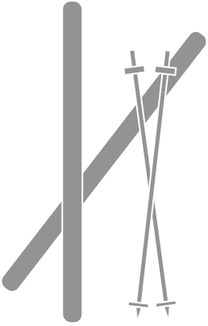

<!-- Improved compatibility of back to top link: See: https://github.com/othneildrew/norrona/pull/73 -->
<a name="readme-top"></a>
<!--
*** Thanks for checking out the norrona. If you have a suggestion
*** that would make this better, please fork the repo and create a pull request
*** or simply open an issue with the tag "enhancement".
*** Don't forget to give the project a star!
*** Thanks again! Now go create something AMAZING! :D
-->


<!-- PROJECT SHIELDS -->
<!--
*** I'm using markdown "reference style" links for readability.
*** Reference links are enclosed in brackets [ ] instead of parentheses ( ).
*** See the bottom of this document for the declaration of the reference variables
*** for contributors-url, forks-url, etc. This is an optional, concise syntax you may use.
*** https://www.markdownguide.org/basic-syntax/#reference-style-links
-->
[![Contributors][contributors-shield]][contributors-url]
[![Forks][forks-shield]][forks-url]
[![Stargazers][stars-shield]][stars-url]
[![Issues][issues-shield]][issues-url]
[![MIT License][license-shield]][license-url]
[![LinkedIn][linkedin-shield]][linkedin-url]


<!-- PROJECT LOGO -->
<br />
<div align="center">
  <a href="https://github.com/othneildrew/norrona">
    
  </a>

  <h3 align="center">norrona</h3>

  <p align="center">
    Tool to monitor the Norrona online outlet. 

    Work in progress

    <div>
        <a href="https://github.com/othneildrew/norrona/issues">Report Bug</a>
        ·
        <a href="https://github.com/othneildrew/norrona/issues">Request Feature</a>
    </div>
  </p>
</div>


<!-- TABLE OF CONTENTS -->
<details>
  <summary>Table of Contents</summary>
  <ol>
    <li>
      <a href="#about-the-project">About The Project</a>
      <ul>
        <li><a href="#built-with">Built With</a></li>
      </ul>
    </li>
    <li>
      <a href="#getting-started">Getting Started</a>
      <ul>
        <li><a href="#prerequisites">Prerequisites</a></li>
        <li><a href="#installation">Installation</a></li>
      </ul>
    </li>
    <li><a href="#usage">Usage</a></li>
    <li><a href="#roadmap">Roadmap</a></li>
    <li><a href="#contributing">Contributing</a></li>
    <li><a href="#license">License</a></li>
    <li><a href="#contact">Contact</a></li>
    <li><a href="#acknowledgments">Acknowledgments</a></li>
  </ol>
</details>


<!-- ABOUT THE PROJECT -->
## About The Project

[![Product Name Screen Shot][product-screenshot]](https://example.com)

  Norrona is one of the most famous Scandinavian brands selling ski and snowboard clothing. Not only do they produce garments and accessories of high quality, but also pay close attention to the [sustainability aspect](https://www.norrona.com/sv-SE/om-norrona/socialt-och-miljoansvar/). This is one of the factors that makes me - as well as many others around the world - trust the company: you can be sure you are contributing to making this world a better place when buying their products. However, not all of us can afford buying Norrona jackets at full price. For that the company has made an outlet: a selection of products can be bought at reduced price, which makes sustainable functional design clothes more accessible to the general public.

  The challenge with the outlet is that (as it ~~always~~ often happens) most common sizes are available for a very short period of time. These products are usually sold as soon as they appear on the webpage (or at least it seems so). To overcome this issue I have developed a tool that monitors the outlet and notifies the user when the product of his size is available:)

<p align="right">(<a href="#readme-top">back to top</a>)</p>


### Built With

This section should list any major frameworks/libraries used to bootstrap your project. Leave any add-ons/plugins for the acknowledgements section. Here are a few examples.

* C#, .NET

<p align="right">(<a href="#readme-top">back to top</a>)</p>


<!-- GETTING STARTED -->
## Getting Started

To get a local copy up and running follow these simple example steps.

### Prerequisites

* Microsoft Visual Studio 2022

### Installation

_Below is an example of how you can instruct your audience on installing and setting up your app. This template doesn't rely on any external dependencies or services._

1. Choose a Norrona product you would like to get notified about from the outlet
2. Clone the repo
   ```sh
   git clone https://github.com/STASYA00/norrona.git
   ```
3. Build the project in Visual Studio
4. Run the project

<p align="right">(<a href="#readme-top">back to top</a>)</p>


<!-- USAGE EXAMPLES -->
## Usage

Use this space to show useful examples of how a project can be used. Additional screenshots, code examples and demos work well in this space. You may also link to more resources.

_For more examples, please refer to the [Documentation](https://example.com)_

<p align="right">(<a href="#readme-top">back to top</a>)</p>


<!-- ROADMAP -->
## Roadmap

- [ ] Add the existing norrona structure (colors, concepts)
- [ ] Add input as an argument in command line
- [ ] Add warning component
- [ ] Add simple UI to choose the product and size to monitor
- [ ] Multi-language Support
    - [ ] English
    - [ ] Swedish
    - [ ] Norwegian

See the [open issues](https://github.com/STASYA00/norrona/issues) for a full list of proposed features (and known issues).

<p align="right">(<a href="#readme-top">back to top</a>)</p>


<!-- CONTRIBUTING -->
## Contributing

Contributions are what make the open source community such an amazing place to learn, inspire, and create. Any contributions you make are **greatly appreciated**.

If you have a suggestion that would make this better, please fork the repo and create a pull request. You can also simply open an issue with the tag "enhancement".
Don't forget to give the project a star! Thanks again!

1. Fork the Project
2. Create your Feature Branch (`git checkout -b feature/AmazingFeature`)
3. Commit your Changes (`git commit -m 'Add some AmazingFeature'`)
4. Push to the Branch (`git push origin feature/AmazingFeature`)
5. Open a Pull Request

<p align="right">(<a href="#readme-top">back to top</a>)</p>


<!-- LICENSE -->
## License

Distributed under the MIT License. See `LICENSE.txt` for more information.

<p align="right">(<a href="#readme-top">back to top</a>)</p>


<!-- CONTACT -->
## Contact

Stasja Fedorova - [@stasya00](https://stasyafedorova.wixsite.com/designautomation) - 0.0stasya@gmail.com

Project Link: [https://github.com/STASYA00/norrona](https://github.com/STASYA00/norrona)

<p align="right">(<a href="#readme-top">back to top</a>)</p>


<!-- ACKNOWLEDGMENTS -->
## Acknowledgments


* [norrona](https://github.com/othneildrew/norrona)
* [Best-README-Template](https://github.com/othneildrew/Best-README-Template)

<p align="right">(<a href="#readme-top">back to top</a>)</p>


<!-- MARKDOWN LINKS & IMAGES -->
<!-- https://www.markdownguide.org/basic-syntax/#reference-style-links -->
[contributors-shield]: https://img.shields.io/github/contributors/othneildrew/norrona.svg?style=for-the-badge
[contributors-url]: https://github.com/othneildrew/norrona/graphs/contributors
[forks-shield]: https://img.shields.io/github/forks/othneildrew/norrona.svg?style=for-the-badge
[forks-url]: https://github.com/othneildrew/norrona/network/members
[stars-shield]: https://img.shields.io/github/stars/othneildrew/norrona.svg?style=for-the-badge
[stars-url]: https://github.com/othneildrew/norrona/stargazers
[issues-shield]: https://img.shields.io/github/issues/othneildrew/norrona.svg?style=for-the-badge
[issues-url]: https://github.com/othneildrew/norrona/issues
[license-shield]: https://img.shields.io/github/license/othneildrew/norrona.svg?style=for-the-badge
[license-url]: https://github.com/othneildrew/norrona/blob/master/LICENSE.txt
[linkedin-shield]: https://img.shields.io/badge/-LinkedIn-black.svg?style=for-the-badge&logo=linkedin&colorB=555
[linkedin-url]: https://linkedin.com/in/othneildrew
[product-screenshot]: images/screenshot.png
[Next.js]: https://img.shields.io/badge/next.js-000000?style=for-the-badge&logo=nextdotjs&logoColor=white
[Next-url]: https://nextjs.org/
[React.js]: https://img.shields.io/badge/React-20232A?style=for-the-badge&logo=react&logoColor=61DAFB
[React-url]: https://reactjs.org/
[Vue.js]: https://img.shields.io/badge/Vue.js-35495E?style=for-the-badge&logo=vuedotjs&logoColor=4FC08D
[Vue-url]: https://vuejs.org/
[Angular.io]: https://img.shields.io/badge/Angular-DD0031?style=for-the-badge&logo=angular&logoColor=white
[Angular-url]: https://angular.io/
[Svelte.dev]: https://img.shields.io/badge/Svelte-4A4A55?style=for-the-badge&logo=svelte&logoColor=FF3E00
[Svelte-url]: https://svelte.dev/
[Laravel.com]: https://img.shields.io/badge/Laravel-FF2D20?style=for-the-badge&logo=laravel&logoColor=white
[Laravel-url]: https://laravel.com
[Bootstrap.com]: https://img.shields.io/badge/Bootstrap-563D7C?style=for-the-badge&logo=bootstrap&logoColor=white
[Bootstrap-url]: https://getbootstrap.com
[JQuery.com]: https://img.shields.io/badge/jQuery-0769AD?style=for-the-badge&logo=jquery&logoColor=white
[JQuery-url]: https://jquery.com 